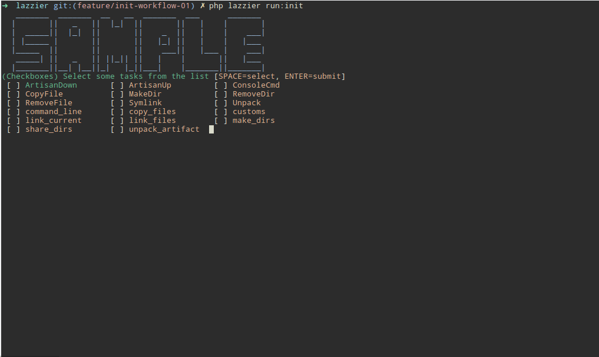

# Console-Selection

A fancy selection interface for symfony's console component.

[](https://scrutinizer-ci.com/g/eddiriarte/console-select/?branch=master)
[](https://scrutinizer-ci.com/g/eddiriarte/console-select/?branch=master)
[](https://scrutinizer-ci.com/g/eddiriarte/console-select/build-status/master)




## Install

```sh
composer require eddiriarte/console-select
```

### On Laravel/Laravel-Zero

Add the `SelectServiceProvider` to your provider list

```php
// app.php
'providers' => [
    EddIriarte\Console\Providers\SelectServiceProvider::class,
],
```

### On Symfony

Add the `EddIriarte\Console\Traits\SelectableInputs` trait to your command class

```php
# importing : \EddIriarte\Console\Helpers\SelectionHelper
# pasing the input and output interfaces
$this->getHelperSet()->set(
  new SelectionHelper($this->input, $this->output)
);
```

## Checkboxes

Useful when you need several answers from the user.

```php
$selected = $this->select(
  'Select characters that appeared in "Star Wars,  Episode I - The phantom menace"',
  [
    'Ahsoka Tano',
    'Anakin Skywalker',
    'Boba Fett',
    'Chewbacca',
    'Count Dooku',
    'Darth Maul',
    'Darth Vader',
    'Finn',
    'Han Solo',
    'Jabba the Hutt',
    'Jar Jar Binks',
    'Kylo Ren',
    'Lando Calrissian',
    'Luke Skywalker',
    'Mace Windu',
    'Obi-Wan Kenobi',
    'Padmé Amidala',
    'Sheev Palpatine',
    'Poe Dameron',
    'Princess Leia Organa',
    'Qui-Gon Jinn',
    'Rey',
    'Watto',
    'Yoda',
  ]
);
```

## Radio

Useful when you need the user to pick only one anwer from the list.

```php
$selected = $this->select(
  'What is the name of the ancient Jedi master that lives at the swamps of Dagobah',
  [
    'Ahsoka Tano',
    'Anakin Skywalker',
    'Boba Fett',
    'Chewbacca',
    'Count Dooku',
    'Darth Maul',
    'Darth Vader',
    'Finn',
    'Han Solo',
    'Jabba the Hutt',
    'Jar Jar Binks',
    'Kylo Ren',
    'Lando Calrissian',
    'Luke Skywalker',
    'Mace Windu',
    'Obi-Wan Kenobi',
    'Padmé Amidala',
    'Sheev Palpatine',
    'Poe Dameron',
    'Princess Leia Organa',
    'Qui-Gon Jinn',
    'Rey',
    'Watto',
    'Yoda',
  ],
  false // third argument(bool) that allows multiple selections (default: true)
);
```

## Still to do

- Handle user-interruptions, such as `Ctrl+C`

## MIT License

Copyright (c) 2018 Eduardo Iriarte

Permission is hereby granted, free of charge, to any person obtaining a copy
of this software and associated documentation files (the "Software"), to deal
in the Software without restriction, including without limitation the rights
to use, copy, modify, merge, publish, distribute, sublicense, and/or sell
copies of the Software, and to permit persons to whom the Software is
furnished to do so, subject to the following conditions:

The above copyright notice and this permission notice shall be included in all
copies or substantial portions of the Software.

THE SOFTWARE IS PROVIDED "AS IS", WITHOUT WARRANTY OF ANY KIND, EXPRESS OR
IMPLIED, INCLUDING BUT NOT LIMITED TO THE WARRANTIES OF MERCHANTABILITY,
FITNESS FOR A PARTICULAR PURPOSE AND NONINFRINGEMENT. IN NO EVENT SHALL THE
AUTHORS OR COPYRIGHT HOLDERS BE LIABLE FOR ANY CLAIM, DAMAGES OR OTHER
LIABILITY, WHETHER IN AN ACTION OF CONTRACT, TORT OR OTHERWISE, ARISING FROM,
OUT OF OR IN CONNECTION WITH THE SOFTWARE OR THE USE OR OTHER DEALINGS IN THE
SOFTWARE.